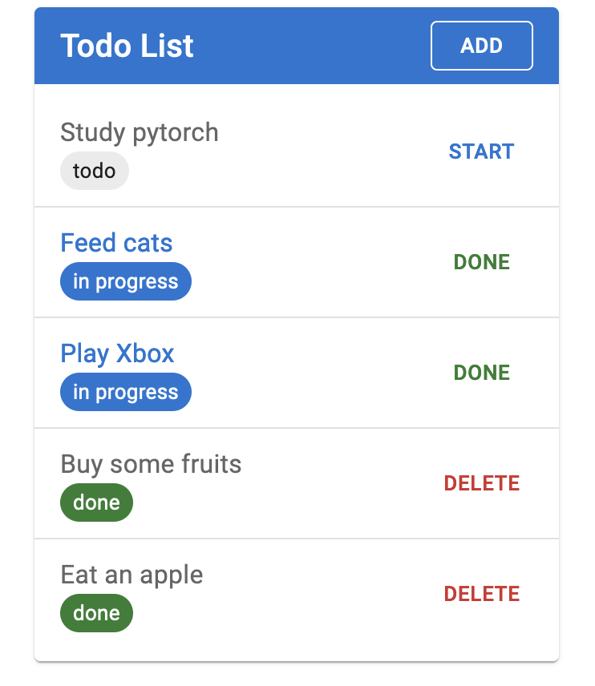

# fastapi-todo-app


## Usage

### Install and run server

```bash
git clone https://github.com/beary/fastapi-todo-app.git
cd fastapi-todo-app

# Create virtual environment
python -m venv .venv
source .venv/bin/activate

# Install python dependencies
python -m pip install -U pip
python -m pip install -U poetry
python -m poetry install

# Configure database (edit .env)
cp example.env .env

# Initialize database
python -m alembic upgrade head

# Run server
python -m fastapi run --app app app/main.py
```

### Install and run web

prerequisites:

- node
- pnpm

```bash
cd web
pnpm install
pnpm run dev
```

visit http://localhost:5173


